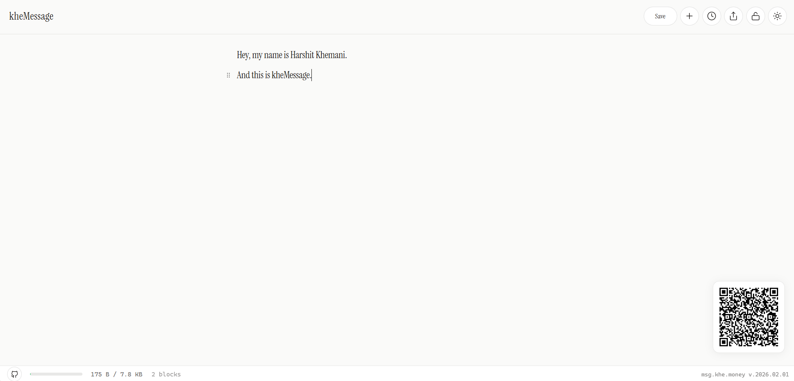
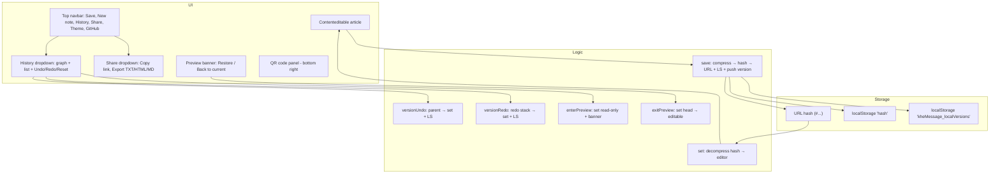
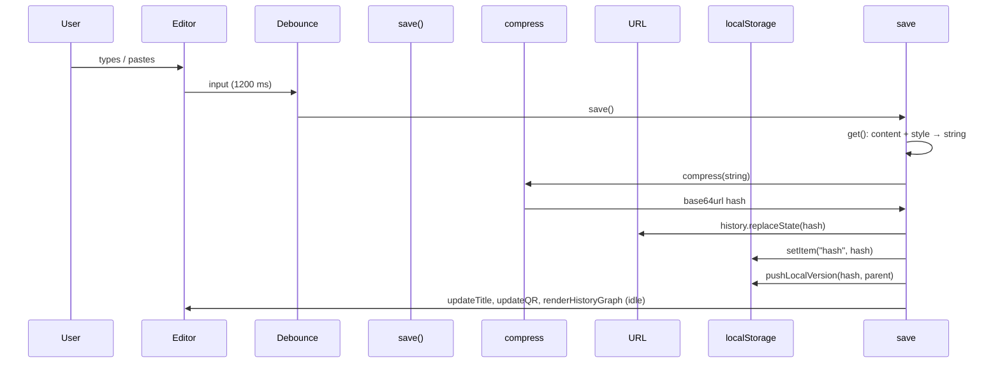
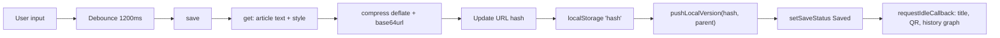
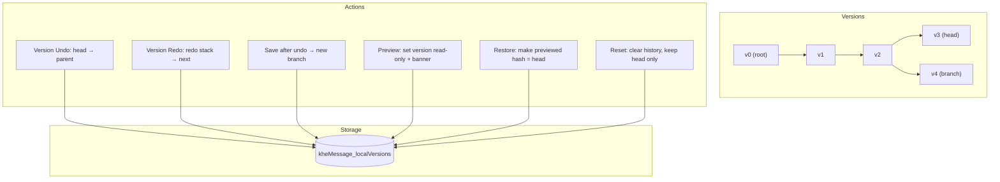

# kheMessage

A minimal, in-browser text editor that stores everything in the URL. Part of [khe.money](https://khe.money).

**Live:** [msg.khe.money](https://msg.khe.money)

[](https://vercel.com/new/clone?repository-url=https://github.com/HKTITAN/kheMessage)

<p align="center">
  
</p>

---

## Quick Start

No build step. Run locally:

```bash
# Option 1: Open index.html directly in a browser

# Option 2: Local server (recommended for full features)
python -m http.server 8000
# or: npx serve .
# Then visit http://localhost:8000
```

---

## Features

- **Block editor** — Notion-style blocks: `/` for slash commands, Tab/Shift+Tab to indent, drag handles to reorder. Supports headings, lists, todos, code, quotes, callouts, dividers, toggles.
- **URL as storage** — Content is compressed (binary + deflate/brotli + base85) and stored in the URL hash. ~25–40% more capacity than before. No backend, no accounts.
- **Share by link** — Copy the URL to share; recipients see the same content when they open it.
- **QR code** — Use `/qr` for a QR code of the current page; a small QR is also shown in the bottom-right panel.
- **Local version history** — Git-like branching stored in `localStorage`: each version has a hash, timestamp, and parent. You can undo/redo across versions and create branches by editing an older version and saving.
- **History graph** — In the **History** menu: SVG graph (time left→right, branches stacked) and a vertical list. Click a version to **preview** it (read-only with a banner); from there you can **Restore this version** or **Back to current**.
- **Version undo/redo** — Buttons in the History menu step to parent (undo) or forward along the redo stack (redo). Editor undo/redo remains `Ctrl+Z` / `Ctrl+Y`.
- **Reset** — Clears version history and keeps only the current document as a single version.
- **Export** — Share menu: **Copy link**, **Export TXT**, **Export HTML**, **Export MD**.
- **Lock** — Share menu: **Lock with password** encrypts content (AES-GCM). Share the password separately with recipients.
- **URL size limit** — Status bar shows URL size; at 8 KB input is blocked (typing disabled, paste truncated). Delete content to continue.
- **Theme** — Light/dark via `?theme=light` or `?theme=dark`, or system preference.
- **PWA** — Installable; manifest and service worker for offline support.

---

## Project Structure

```
kheMessage/
├── index.html          # Main app (single file: CSS + HTML + JS)
├── qr.html             # Full-page QR code view
├── 404.html            # Fallback for invalid routes
├── qrcode.js           # QR code generation library
├── sw.js               # Service worker (PWA, offline)
├── manifest.json       # PWA manifest
├── vercel.json         # Vercel deployment config
├── .github/workflows/  # CI (Vercel deploy on push)
├── docs/               # Documentation
│   ├── ARCHITECTURE.md # System overview, diagrams
│   ├── CODE_STRUCTURE.md # index.html section map
│   ├── DEPLOYMENT.md   # Vercel setup
│   ├── DEVELOPMENT.md  # Local setup, code style
│   └── TESTING.md      # Testing checklist
├── CONTRIBUTING.md     # Contribution guidelines
├── LICENSE             # MIT License
└── windows_11_cursors_concept_by_jepricreations_densjkc/
    ├── light/          # Light theme cursors
    └── dark/           # Dark theme cursors
```

---

## How it works (overview)

1. You type in a **block editor** (Notion-style): each line is a block. Use `/` for slash commands, Tab/Shift+Tab to indent, drag handles to reorder. Content is Markdown-friendly with inline formatting.
2. Changes are **debounced** (e.g. 1200 ms); then **save** runs: content + optional inline styles are compressed, turned into a hash, and written to the URL and `localStorage`. A **version entry** `{ hash, t, parents }` is appended to local history.
3. **Version undo** moves to the parent of the current head and pushes the current head onto a redo stack; **version redo** pops from that stack. Any new save clears the redo stack and can create a new branch.
4. **Preview** loads a chosen version into the editor (read-only), with a banner to restore that version or return to the current head.

For a deeper dive, see [docs/ARCHITECTURE.md](docs/ARCHITECTURE.md).

---

## Architecture



---

## Data flow (content ↔ URL ↔ localStorage)



---

## Auto-save and version push



- **MutationObserver** (e.g. style changes) is debounced (~800 ms) and also triggers save.
- **Save button** shows "Save" / "Saving…" / "Saved" and does not block the main thread for heavy work; compression and UI updates run in idle or setTimeout.

---

## Version history (branching, undo, redo, preview)



- Each version is `{ hash, t, parents }`. **Head** = `localStorage['hash']`.
- **Version undo**: set head to `parents[0]`, push current head onto `versionRedoStack`.
- **Version redo**: pop from `versionRedoStack`, set that as head.
- **New save**: clears `versionRedoStack`, appends new version with current head as parent (branch if you had undone).
- **Preview**: load version with `set(hash)`, make editor read-only, show banner; **Restore** writes that hash to `localStorage` and URL and exits preview; **Back to current** calls `exitPreview()` (load head, editable).
- **Reset**: replace version history with a single entry for current head (or clear if no head).

---

## Usage

| Action | How |
|--------|-----|
| **Edit** | Type in blocks; `/` for slash commands; Tab/Shift+Tab to indent; drag handles to reorder. Markdown-style formatting. |
| **Save** | Automatic (debounced). Navbar button shows status. |
| **New note** | Navbar **+** button: clears content and local version history, empty URL. |
| **History** | Navbar **History**: graph, list, **Undo** / **Redo** (version), **Reset**, and click a version to preview. |
| **Preview** | In History, click a version → read-only view + banner → **Restore this version** or **Back to current**. |
| **Share** | Navbar **Share**: Copy link, Export TXT/HTML/MD. |
| **QR** | Open `/qr` for full-page QR, or use the QR in the bottom-right panel. |
| **Theme** | Use `?theme=light` or `?theme=dark`, or the theme toggle in the navbar. |

---

## Tech Stack

- **Single HTML file**: structure, styles, and script in [index.html](index.html).
- **Compression**: `CompressionStream` (deflate-raw or brotli) + base85 encoding. Optional AES-GCM encryption for locked notes.
- **Storage**: `location.hash`, `history.replaceState`, `localStorage` (current hash + version list).
- **Icons**: Inline SVGs (Heroicons-style). Cursors: see **Attribution** below.

No backend, no build step. Optional: `qr.html` + `qrcode.js` for QR, `sw.js` for service worker, `manifest.json` for PWA.

For code organization, see [docs/CODE_STRUCTURE.md](docs/CODE_STRUCTURE.md).

---

## Documentation

| Document | Description |
|----------|-------------|
| [docs/ARCHITECTURE.md](docs/ARCHITECTURE.md) | System overview, compression pipeline, version history, PWA |
| [docs/CODE_STRUCTURE.md](docs/CODE_STRUCTURE.md) | index.html section map, key functions, format versions |
| [docs/DEVELOPMENT.md](docs/DEVELOPMENT.md) | Local setup, code style, where to add features |
| [docs/DEPLOYMENT.md](docs/DEPLOYMENT.md) | Vercel setup, GitHub Actions, secrets |
| [docs/TESTING.md](docs/TESTING.md) | Testing checklist |

---

## Contributing

Contributions are welcome. See [CONTRIBUTING.md](CONTRIBUTING.md) for guidelines.

---

## Deployment

kheMessage deploys to [Vercel](https://vercel.com) with zero configuration. Click the **Deploy to Vercel** button above, or run `npx vercel`.

**GitHub Actions** (`.github/workflows/deploy.yaml`) deploys automatically on push to `main`/`master`. Requires secrets: `VERCEL_TOKEN`, `VERCEL_ORG_ID`, `VERCEL_PROJECT_ID`.

For full setup, see [docs/DEPLOYMENT.md](docs/DEPLOYMENT.md).

---

## References

- **Block editor / data model** — Inspired by [The Data Model Behind Notion](https://www.notion.com/blog/data-model-behind-notion) (Notion's block-based architecture, indentation, nesting).

---

## Attribution

- **Editor concept / URL storage** — Based on [textarea](https://github.com/antonmedv/textarea) by **Anton Medvedev**. kheMessage extends it with version history, branching, preview, export, and UI changes.
- **Custom cursors** — [Windows 11 Cursors Concept](https://www.deviantart.com/jepricreations) (light and dark) by **jepriCreations**, used under the pack's terms. Integrated in this repo from `windows_11_cursors_concept_by_jepricreations_densjkc/`.

---

## License

[MIT License](LICENSE). Third-party assets (cursors) follow their respective terms.
