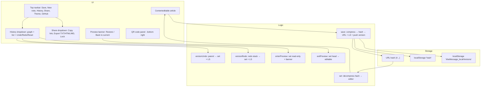
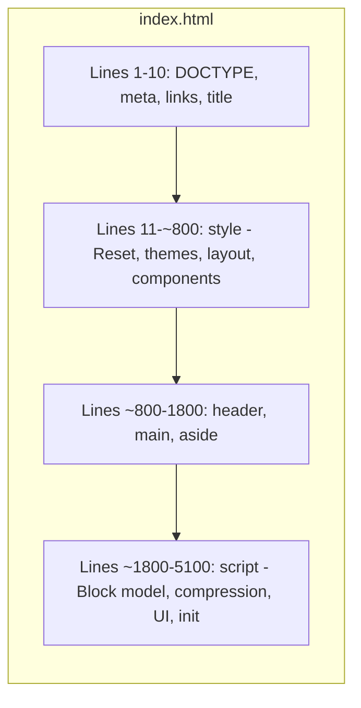
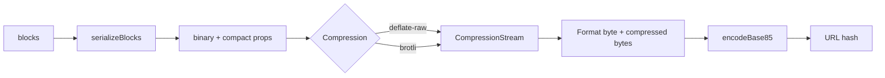
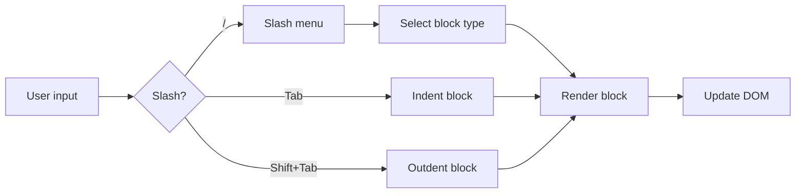
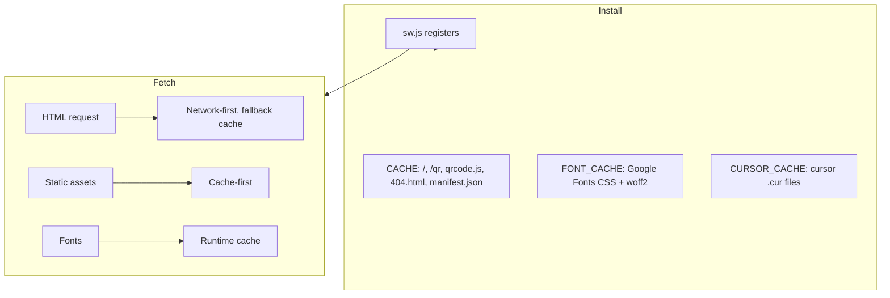

# kheMessage Architecture

This document describes the high-level architecture of kheMessage, a minimal in-browser text editor that stores content in the URL.

## System Overview



## index.html Structure

The application is a single HTML file. The structure follows this layout:



| Section | Lines | Content |
|---------|-------|---------|
| Meta | 1–10 | DOCTYPE, charset, viewport, manifest, fonts, title |
| CSS | 11–~800 | Reset, themes (light/dark), layout, block styles, responsive |
| HTML | ~800–1800 | Navbar, main article, aside panel, modals |
| Script | ~1800–5100 | Block model, compression, encryption, UI logic, init |

## Compression Pipeline

Content flows from blocks to URL hash through the following pipeline:



**Format versions:**

| Format byte | Encoding | Compression |
|-------------|----------|-------------|
| (legacy) | base64url | deflate-raw |
| 0x01 | base64url | deflate-raw |
| 0x02 | base85 | deflate-raw |
| 0x03 | base85 | encrypted (AES-GCM) |
| 0x04 | base85 | brotli |

Format detection: if the hash contains characters outside base64url (`A-Za-z0-9_-`), it is base85.

## Storage Layout

```mermaid
flowchart TB
  subgraph URL
    Origin[origin + path]
    Query[?theme=light|dark]
    Hash[#base85EncodedContent]
  end

  subgraph localStorage
    HashKey["'hash' = current head hash"]
    VersionsKey["'kheMessage_localVersions' = JSON array of version entries"]
  end

  Hash --> HashKey
  Hash --> VersionsKey
```

**localStorage keys:**

- `hash` — Current head hash (compressed content)
- `kheMessage_localVersions` — Array of `{ hash, t, parents }` entries (max 50)

## Version History

kheMessage implements a Git-like version history with branching and merge support.

```mermaid
flowchart TB
  subgraph Versions
    V0["v0 (root, parents: [])"]
    V1["v1"]
    V2["v2"]
    V3["v3 (head)"]
    V4["v4 (branch)"]
    V5["v5 (merge)"]
  end

  V0 --> V1 --> V2 --> V3
  V2 --> V4
  V3 --> V5
  V4 --> V5

  subgraph Actions
    Undo[Version Undo: head → parents[0]]
    Redo[Version Redo: redo stack → next]
    SaveAfter[Save after undo → new branch]
    Preview[Preview: set version read-only + banner]
    Restore[Restore: make previewed hash = head]
    Reset[Reset: clear history, keep head only]
  end
```

**Version entry structure:**

```javascript
{
  hash: '#base85...',    // Compressed content
  t: 1234567890,         // Timestamp (Date.now())
  parents: ['#parent']   // [] for root, [parent] for normal, [p1, p2] for merge
}
```

## Block Model Flow



Block types: paragraph, h1–h6, bullet, number, todo, code, quote, callout, divider, toggle.

## PWA / Service Worker



Cache version is defined in `sw.js` as `CACHE_VERSION`; updating it invalidates old caches.
