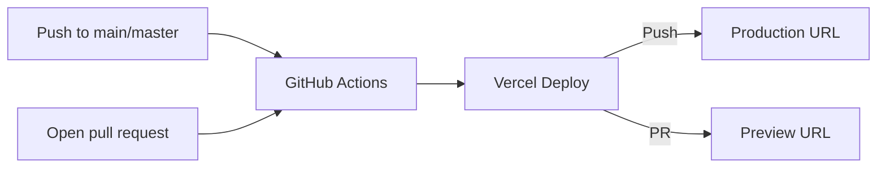

# kheMessage Deployment

kheMessage is optimized for deployment on Vercel with zero configuration.

## Quick Deploy

### Option 1: Deploy Button

Click the "Deploy to Vercel" button in the README, or visit:

```
https://vercel.com/new/clone?repository-url=https://github.com/HKTITAN/kheMessage
```

### Option 2: Vercel CLI

```bash
npm i -g vercel
vercel
```

For production:

```bash
vercel --prod
```

## Deployment Flow



## GitHub Actions

The repository includes `.github/workflows/deploy.yaml` that:

- **Triggers**: Push to `master`/`main`, pull requests, manual dispatch
- **Production**: Automatic deploy on push to main branches
- **Preview**: Automatic deploy on pull requests (URL commented on PR)
- **Action**: Uses `amondnet/vercel-action@v25`
- **Secrets guard**: Deploy steps are skipped when required secrets are missing (common for forked PRs).

### Required GitHub Secrets

Add these in **Settings → Secrets and variables → Actions**:

| Secret | Description |
|--------|-------------|
| `VERCEL_TOKEN` | Personal access token from [Vercel account tokens](https://vercel.com/account/tokens) |
| `VERCEL_ORG_ID` | From `.vercel/project.json` after first local deploy |
| `VERCEL_PROJECT_ID` | From `.vercel/project.json` after first local deploy |

### Setup Steps

1. Run `npx vercel` once locally to generate `.vercel/project.json`
2. Copy `VERCEL_ORG_ID` and `VERCEL_PROJECT_ID` from that file
3. Create a token at [vercel.com/account/tokens](https://vercel.com/account/tokens)
4. Add all three secrets to GitHub
5. Push to `master`/`main` — deployment runs automatically

## Configuration (vercel.json)

The project includes `vercel.json` with:

- **Clean URLs**: `/qr` maps to `qr.html`
- **Security headers**: X-Content-Type-Options, X-Frame-Options, X-XSS-Protection, Referrer-Policy, Permissions-Policy
- **Cache headers**:
  - `sw.js`: `max-age=0, must-revalidate` (always fresh)
  - `manifest.json`: `max-age=86400` (1 day)
  - `qrcode.js`: `max-age=31536000, immutable` (1 year)
  - Cursor files: `max-age=31536000, immutable` (1 year)

## No Edge Functions

This project is **static-only** and does not use Vercel Edge Functions or serverless functions. All functionality is client-side in `index.html`.

## Custom Domain

1. Add your domain in Vercel project settings
2. Update DNS records as instructed by Vercel
3. QR codes will automatically use the new domain (uses `location.origin`)

## Rollback

If issues are found:

1. **Git revert**: `git revert HEAD` then push
2. **Vercel dashboard**: Promote a previous deployment from the Deployments tab
